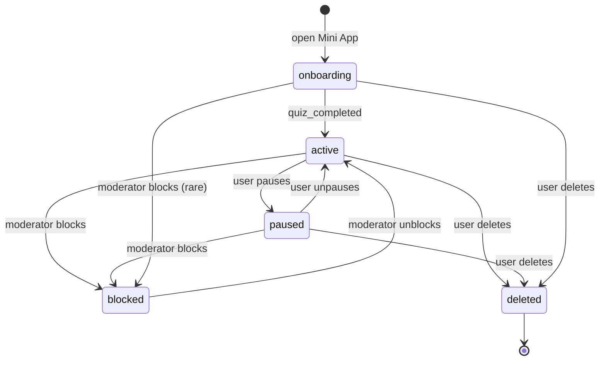
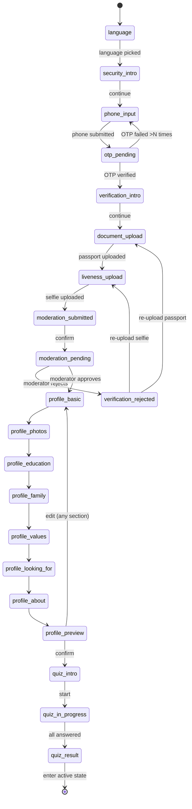
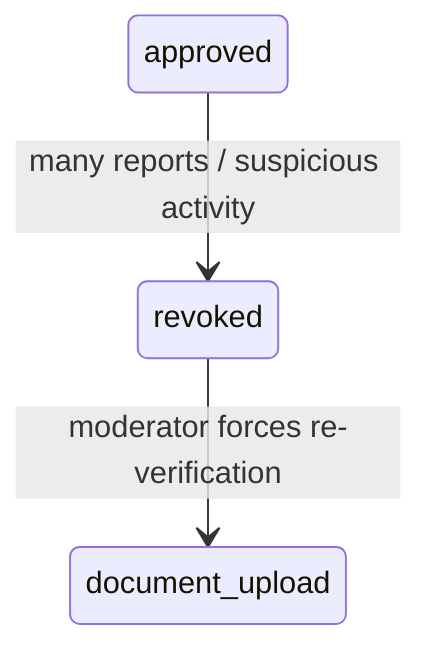

# Bakhtlilar — State Machine & User Routing

**Версия:** v1.0 (MVP)
**Дата:** 2026-05-07
**Статус документа:** Source-of-truth для роутинга и доступов в MVP
**Аудитория:** product, frontend, backend, QA, модерация

Этот документ описывает state machine пользователя в Bakhtlilar Telegram Mini App. Он является фундаментом, на котором строится:

- какой экран показать пользователю при открытии Mini App;
- как пользователь переходит между этапами;
- что ему доступно на каждом этапе;
- как сервер и клиент должны интерпретировать его текущий статус;
- как обрабатываются edge cases (потерянная сессия, отказ модератора, блокировка, пауза).

Главный продуктовый принцип, который state machine реализует:

> **Без доверия нет доступа. Без анкеты нет matching. Без взаимного согласия нет чата.**

---

## 1. Архитектурные принципы

### 1.1. Status-driven UI

Mini App не имеет «свободной» навигации до полного онбординга. Любой запуск приложения проходит через **один маршрутизатор**, который читает статус пользователя с сервера и решает, какой экран показать. Пользователь не может «пропустить шаг» через прямой URL/deep link — клиент всегда сверяется с сервером.

### 1.2. Server is source of truth

Все статусы хранятся и обновляются на сервере. Клиент **не должен** локально решать, что пользователь «уже готов» — он только отображает то, что сервер ему вернул. Это критично для безопасности: статус `verification_approved` нельзя подделать на клиенте.

### 1.3. Resumable onboarding

Если пользователь закрыл Mini App в середине онбординга, при следующем открытии он должен попасть **на тот же шаг**, на котором остановился. Никакого «начать заново».

### 1.4. Декомпозированная модель состояний

Один пользователь имеет несколько ортогональных состояний:

- `lifecycle_state` — где пользователь в жизненном цикле (онбординг, активен, на паузе, заблокирован).
- `onboarding_step` — на каком шаге онбординга, если ещё не active.
- `verification_status` — в каком состоянии его паспортная проверка (отдельный аспект, может пересматриваться независимо после жалоб).
- `profile_completion` — полнота анкеты.
- `quiz_completion` — пройден ли квиз.

В TZ описан **плоский список** статусов — он удобен как user-facing enum, но внутри сервера должна быть декомпозиция (см. раздел 4). Плоский статус выводится как функция от декомпозированных полей.

### 1.5. Идемпотентные переходы

Каждый переход между статусами должен быть идемпотентен: повторная отправка того же события не ломает state. Например, повторная отправка OTP-кода не должна создать второго пользователя.

### 1.6. Аудит и обратимость

Каждый переход состояния должен:
- логироваться в `user_state_transitions` (старый статус, новый статус, причина, кто инициировал, timestamp);
- быть обратимым модератором (например, отзыв одобрения).

---

## 2. Глобальные lifecycle states

На верхнем уровне пользователь находится ровно в одном из этих состояний:

| Lifecycle state | Описание | Доступ к продукту |
|---|---|---|
| `onboarding`   | Пользователь в процессе регистрации/верификации/анкеты/квиза | Только онбординг-экраны соответствующего шага |
| `active`       | Полностью верифицирован, анкета и квиз пройдены | Полный доступ: рекомендации, запросы, чаты |
| `paused`       | Сам поставил профиль на паузу | Видит свои чаты, но не виден в рекомендациях, не может отправлять новые запросы |
| `blocked`      | Заблокирован модератором | Только экран блокировки + поддержка |
| `deleted`      | Удалил аккаунт | Нет доступа; при попытке входа — экран регистрации заново |

### Переходы lifecycle

```
onboarding ──► active        (после quiz_completed)
active     ──► paused        (пользователь сам)
paused     ──► active        (пользователь сам)
active     ──► blocked       (модератор)
paused     ──► blocked       (модератор)
blocked    ──► active        (модератор разблокировал)
*          ──► deleted       (пользователь удалил аккаунт)
```

---

## 3. Onboarding sub-states

Пока `lifecycle_state = onboarding`, пользователь находится на одном из подэтапов:

| Onboarding step | Что закончил пользователь | Что нужно сделать дальше |
|---|---|---|
| `language`            | Открыл Mini App                  | Выбрать язык |
| `security_intro`      | Выбрал язык                       | Прочитать объяснение безопасности |
| `phone_input`         | Прочитал объяснение               | Ввести номер телефона |
| `otp_pending`         | Ввёл номер, отправлен SMS         | Подтвердить OTP |
| `verification_intro`  | Подтвердил OTP                    | Прочитать что нужно для верификации |
| `document_upload`     | Открыл инструкцию по паспорту     | Загрузить фото паспорта |
| `liveness_upload`     | Загрузил паспорт                  | Сделать selfie / liveness |
| `moderation_submitted`| Загрузил selfie                   | Прочитать «заявка отправлена» |
| `moderation_pending`  | Подтвердил отправку               | Ждать решения модератора |
| `verification_rejected`| Модератор отклонил               | Прочитать причину, перезагрузить документы |
| `profile_basic`       | Модератор одобрил                 | Заполнить базовую информацию |
| `profile_photos`      | Заполнил базовое                  | Загрузить фото профиля |
| `profile_education`   | Загрузил фото                     | Заполнить образование/работу |
| `profile_family`      | Заполнил образование              | Заполнить семейные планы |
| `profile_values`      | Заполнил семью                    | Заполнить ценности и образ жизни |
| `profile_looking_for` | Заполнил ценности                 | Заполнить кого ищет |
| `profile_about`       | Заполнил кого ищет                | Заполнить «о себе» |
| `profile_preview`     | Заполнил «о себе»                 | Подтвердить анкету (предпросмотр) |
| `quiz_intro`          | Подтвердил анкету                 | Прочитать вступление к квизу |
| `quiz_in_progress`    | Начал квиз                        | Ответить на оставшиеся вопросы |
| `quiz_result`         | Ответил на все вопросы            | Прочитать результат и перейти на главную |

После `quiz_result` → `lifecycle_state = active`.

---

## 4. Декомпозированная модель данных

Рекомендуемая структура полей в БД (упрощённо):

```
users
├── id                       uuid
├── telegram_id              bigint, unique, not null
├── telegram_username        text
├── telegram_first_name      text
├── telegram_last_name       text
├── language                 enum('ru','uz')           nullable
├── phone_number             text                       nullable, unique when verified
├── phone_verified           bool                       default false
├── phone_verified_at        timestamptz
├── lifecycle_state          enum                       default 'onboarding'
├── onboarding_step          enum                       default 'language'
├── verification_status      enum                       default 'not_started'
├── profile_completion       enum                       default 'not_started'
├── quiz_completion          enum                       default 'not_started'
├── paused_at                timestamptz                nullable
├── blocked_at               timestamptz                nullable
├── blocked_reason           text                       nullable
├── created_at               timestamptz
└── updated_at               timestamptz
```

### 4.1. verification_status enum

| Значение | Когда устанавливается |
|---|---|
| `not_started`        | Сразу после регистрации |
| `phone_verified`     | После успешного OTP |
| `documents_uploaded` | После загрузки паспорта (но до selfie) |
| `liveness_uploaded`  | После загрузки selfie — заявка автоматически уходит в `pending_review` |
| `pending_review`     | В очереди модерации |
| `approved`           | Модератор одобрил |
| `rejected`           | Модератор отклонил |
| `revoked`            | Был approved, но отозван (например, после массовых жалоб) |

### 4.2. profile_completion enum

| Значение | Когда устанавливается |
|---|---|
| `not_started`        | До модерации |
| `in_progress`        | Заполняет, но не дошёл до preview |
| `completed`          | Подтвердил предпросмотр |
| `pending_remoderation`| Изменил критичное поле, ждёт повторной модерации |

### 4.3. quiz_completion enum

| Значение | Когда устанавливается |
|---|---|
| `not_started` | Анкета только что completed |
| `in_progress` | Начал отвечать |
| `completed`   | Ответил на все вопросы и получил результат |

### 4.4. Соответствие плоскому статусу из TZ

TZ оперирует плоским enum. Это **derived value**, рассчитывается так:

```
def derive_flat_status(user):
    if user.lifecycle_state == 'blocked':           return 'blocked'
    if user.lifecycle_state == 'paused':            return 'paused'
    if user.lifecycle_state == 'active':            return 'active'

    # onboarding
    if user.quiz_completion == 'completed':         return 'quiz_completed'
    if user.profile_completion == 'completed':      return 'profile_completed'
    if user.profile_completion == 'in_progress':    return 'profile_started'
    if user.verification_status == 'approved':      return 'verification_approved'
    if user.verification_status == 'rejected':      return 'verification_rejected'
    if user.verification_status == 'pending_review':return 'verification_pending'
    if user.verification_status == 'liveness_uploaded': return 'liveness_uploaded'
    if user.verification_status == 'documents_uploaded':return 'document_uploaded'
    if user.phone_verified:                          return 'phone_verified'
    if user.phone_number:                            return 'phone_entered'
    if user.language:                                return 'language_selected'
    return 'new'
```

Плоский enum используется в API ответах и аналитике; в БД хранится декомпозированная модель.

---

## 5. Полная диаграмма переходов

### 5.1. Высокоуровневая (lifecycle)



### 5.2. Onboarding pipeline



### 5.3. Verification re-entry

После одобрения возможен возврат в верификацию (revoked):



В этом состоянии `lifecycle_state` остаётся `active` или становится `paused` (на усмотрение бизнеса), но клиент насильно показывает экран загрузки документов до новой проверки.

---

## 6. Routing matrix: статус → экран

Главный роутер Mini App при каждом запуске вычисляет, какой экран показать. Логика:

```
1. Если lifecycle_state == 'blocked'  → Экран 45 (Блокировка)
2. Если lifecycle_state == 'paused'   → Главная (но в режиме «пауза»)
3. Если lifecycle_state == 'active'   → Главная
4. Если lifecycle_state == 'onboarding' → routing по onboarding_step (см. таблицу)
```

### 6.1. Onboarding routing table

| onboarding_step          | Номер экрана из TZ | Название экрана                   |
|---|---|---|
| `language`               | 1, 2          | Welcome → Выбор языка                  |
| `security_intro`         | 3             | Объяснение безопасности                |
| `phone_input`            | 4             | Ввод номера телефона                   |
| `otp_pending`            | 5             | Ввод OTP                               |
| `verification_intro`     | 6             | Начало верификации                     |
| `document_upload`        | 7, 8          | Инструкция → Загрузка паспорта         |
| `liveness_upload`        | 9, 10         | Инструкция → Selfie/Liveness           |
| `moderation_submitted`   | 11            | Проверка отправлена                    |
| `moderation_pending`     | 12            | Ожидание модерации                     |
| `verification_rejected`  | 13            | Проверка отклонена                     |
| `profile_basic`          | 14, 15        | Проверка одобрена → Базовая инфо       |
| `profile_photos`         | 16            | Фото профиля                           |
| `profile_education`      | 17            | Образование и работа                   |
| `profile_family`         | 18            | Семья и планы                          |
| `profile_values`         | 19            | Ценности и образ жизни                 |
| `profile_looking_for`    | 20            | Кого ищу                               |
| `profile_about`          | 21            | О себе                                 |
| `profile_preview`        | 22            | Предпросмотр анкеты                    |
| `quiz_intro`             | 23            | Семейный компас — вступление           |
| `quiz_in_progress`       | 24            | Вопросы квиза                          |
| `quiz_result`            | 25            | Результат квиза                        |

### 6.2. Active state — главные разделы

Когда `lifecycle_state = active`, пользователь видит таб-бар из 5 разделов:

| Раздел       | Корневой экран                  |
|---|---|
| Главная      | Экран 26                        |
| Рекомендации | Экран 27                        |
| Запросы      | Экран 33 (входящие) + Экран 36 (мои) |
| Чаты         | Экран 37                        |
| Профиль      | Экран 40                        |

Внутри каждого раздела — свои дочерние экраны (профиль другого пользователя, чат, редактирование, paywall и т.д.). Они доступны только из active состояния.

### 6.3. Paused state

В состоянии `paused` пользователь видит:
- Таб «Чаты» — доступен, может отвечать в существующих чатах.
- Таб «Профиль» — доступен, может вернуться в active (снять паузу).
- Таб «Главная», «Рекомендации», «Запросы» — показывают экран-заглушку «Профиль на паузе. Чтобы получать рекомендации, снимите паузу».

Новые исходящие запросы заблокированы. Входящие запросы продолжают приходить — они появятся, когда пользователь снимет паузу.

### 6.4. Blocked state

В состоянии `blocked` пользователь видит **только** Экран 45 (Блокировка). Все API-запросы кроме «Поддержка» возвращают 403.

---

## 7. Access gates (что разрешено в каком статусе)

Это **серверный** контроль доступа. Клиент дублирует логику для UX, но финальное решение — за сервером.

### 7.1. Матрица доступа

| Возможность                              | onboarding | active | paused | blocked |
|---|---|---|---|---|
| Видеть свой профиль                      | частично*  | ✓      | ✓      | ✗       |
| Редактировать анкету                     | ✗          | ✓      | ✓      | ✗       |
| Загружать фото                           | ✗ (только во время onboarding)| ✓      | ✓      | ✗       |
| Видеть рекомендации                      | ✗          | ✓      | ✗      | ✗       |
| Видеть чужие профили                     | ✗          | ✓      | по match'у | ✗   |
| Отправлять запросы на знакомство         | ✗          | ✓ (с учётом лимита) | ✗ | ✗ |
| Получать входящие запросы                | ✗          | ✓      | ✓ (отложенно) | ✗ |
| Принимать/отклонять запросы              | ✗          | ✓      | ✓      | ✗       |
| Писать в чате                            | ✗          | ✓      | ✓      | ✗       |
| Жаловаться                               | ✗          | ✓      | ✓      | ограниченно |
| Блокировать пользователя                 | ✗          | ✓      | ✓      | ✗       |
| Покупать Premium                         | ✗          | ✓      | ✓      | ✗       |
| Удалить аккаунт                          | ✓          | ✓      | ✓      | ✓ (через поддержку) |

\* «Частично» в onboarding значит: пользователь видит данные, которые он сам вводит на текущем шаге, но не видит «карточку профиля» в финальном виде.

### 7.2. Гейт «всё пройдено»

Чтобы lifecycle перешёл в `active`, должны быть выполнены **все** условия:

```
phone_verified == true
AND verification_status == 'approved'
AND profile_completion == 'completed'
AND quiz_completion == 'completed'
AND lifecycle_state != 'blocked'
```

Если хотя бы одно условие не выполнено, пользователь не может попасть на главную.

### 7.3. API-level enforcement

Все эндпоинты, кроме онбординг-эндпоинтов, должны на сервере проверять:

```python
def require_active(user):
    if user.lifecycle_state == 'blocked':
        raise Forbidden("USER_BLOCKED")
    if user.lifecycle_state == 'paused':
        raise Forbidden("USER_PAUSED")
    if user.lifecycle_state != 'active':
        raise Forbidden("ONBOARDING_INCOMPLETE", next_step=user.onboarding_step)
```

Клиент при получении такой ошибки переходит в правильный onboarding-экран — это backup-механизм против рассинхронизации.

---

## 8. События и триггеры переходов

| Событие                                | Откуда       | Эффект                                                       |
|---|---|---|
| `language_picked(lang)`               | клиент        | language = lang; step → security_intro                      |
| `security_intro_seen`                 | клиент        | step → phone_input                                           |
| `phone_submitted(phone)`              | клиент        | phone_number = phone; OTP отправлен; step → otp_pending     |
| `otp_verified(code)`                  | клиент → сервер | phone_verified = true; step → verification_intro           |
| `otp_failed`                          | сервер        | счётчик попыток; при превышении — rate-limit                |
| `passport_uploaded(file)`             | клиент        | document_photo сохранён; verification_status → documents_uploaded; step → liveness_upload |
| `selfie_uploaded(file)`               | клиент        | selfie_photo сохранён; verification_status → liveness_uploaded → pending_review; step → moderation_submitted |
| `moderation_submitted_seen`           | клиент        | step → moderation_pending                                   |
| `moderator_approves(user_id)`         | админка       | verification_status → approved; step → profile_basic; уведомление в Telegram |
| `moderator_rejects(user_id, reason)`  | админка       | verification_status → rejected; step → verification_rejected; уведомление |
| `moderator_requests_repassport`       | админка       | verification_status → rejected; step → document_upload      |
| `moderator_requests_reselfie`         | админка       | verification_status → rejected; step → liveness_upload      |
| `profile_section_completed(section)`  | клиент        | step → next profile section                                 |
| `profile_confirmed`                   | клиент        | profile_completion → completed; step → quiz_intro           |
| `quiz_started`                        | клиент        | quiz_completion → in_progress; step → quiz_in_progress      |
| `quiz_finished`                       | клиент        | quiz_completion → completed; step → quiz_result             |
| `quiz_result_seen`                    | клиент        | lifecycle_state → active                                    |
| `user_pauses`                         | клиент        | lifecycle_state → paused                                    |
| `user_unpauses`                       | клиент        | lifecycle_state → active                                    |
| `moderator_blocks(user_id, reason)`   | админка       | lifecycle_state → blocked                                   |
| `moderator_unblocks(user_id)`         | админка       | lifecycle_state → previous                                  |
| `moderator_revokes_verification`      | админка       | verification_status → revoked; клиент насильно показывает document_upload |
| `user_deletes_account`                | клиент        | lifecycle_state → deleted; soft-delete                      |

---

## 9. Edge cases

### 9.1. Пользователь закрыл Mini App в середине онбординга

Сервер хранит actual onboarding_step. При следующем открытии клиент запрашивает `GET /me`, получает step и рендерит соответствующий экран. Никаких локальных «черновиков» в localStorage — всё на сервере.

### 9.2. Пользователь вводит уже зарегистрированный номер

Поведение зависит от состояния существующей записи:

- Если существующий пользователь имеет тот же `telegram_id` — обновляем его сессию, восстанавливаем его step.
- Если у существующего пользователя **другой** `telegram_id` — это конфликт. На MVP блокируем регистрацию и показываем ошибку: «Этот номер уже привязан к другому Telegram-аккаунту. Обратитесь в поддержку.» Это защита от перехвата аккаунта.

### 9.3. Слишком много неудачных OTP

После N (например 5) неверных попыток за M минут — rate-limit: «Слишком много попыток. Попробуйте через X минут.» Состояние остаётся `otp_pending`, но кнопка «Подтвердить» дизейблится.

### 9.4. OTP-код просрочен

OTP действителен 5 минут. После этого — кнопка «Отправить код повторно».

### 9.5. Модератор отклонил, пользователь хочет перезагрузить только паспорт

В админке модератор выбирает **что именно** нужно перезагрузить:
- паспорт → step переходит в `document_upload`
- selfie → step переходит в `liveness_upload`
- оба → step в `document_upload`, после загрузки автоматически в `liveness_upload`

В сообщении пользователю указывается конкретно, что нужно переснять.

### 9.6. Пользователь редактирует критичное поле в active state

Изменение фото, имени, даты рождения, пола, семейного положения, текста «о себе» → `profile_completion = pending_remoderation`. Пользователь остаётся в active (может пользоваться продуктом со старыми данными), но в админке появляется заявка на повторную модерацию изменения.

Альтернатива (более строгая): пока изменение не одобрено, скрывать профиль из рекомендаций. Это решение бизнеса; на MVP я предлагаю **мягкий вариант** — пользователь не блокируется, но изменение видно другим только после одобрения.

### 9.7. Пользователь ставит профиль на паузу с непрочитанными запросами

Запросы остаются в его inbox; при снятии паузы он их увидит. Отправители не получают уведомление о паузе — для них статус запроса остаётся `pending`.

### 9.8. Заблокированный пользователь пытается удалить аккаунт

Разрешаем — это право пользователя. Аккаунт переходит в `deleted`, но запись не удаляется физически (soft-delete) для аудита и предотвращения повторной регистрации.

### 9.9. Пользователь сменил Telegram-аккаунт

Telegram_id сменился, номер тот же. См. 9.2 — конфликт, через поддержку.

### 9.10. Пользователь пытается «обмануть» статус через DevTools

Клиентский статус — лишь cache. На каждый чувствительный API-запрос сервер делает `require_active()` и возвращает 403, если статус не active. Пользователь не может «прыгнуть» к рекомендациям через прямой API-вызов.

### 9.11. Сервер недоступен / клиент офлайн

Клиент показывает экран-заглушку «Нет соединения. Попробуйте обновить» с кнопкой retry. Никакие действия (особенно отправка запросов) не производятся в офлайне. На MVP не реализуем оптимистичные апдейты.

### 9.12. Match создан, но один из пользователей был заблокирован

Чат становится доступен только не-заблокированному пользователю в read-only режиме. Заблокированный пользователь чат не видит.

---

## 10. Технические рекомендации к реализации

### 10.1. Один API-эндпоинт для роутинга

```
GET /api/v1/me
→ {
    "user_id": "...",
    "lifecycle_state": "onboarding",
    "onboarding_step": "profile_education",
    "verification_status": "approved",
    "profile_completion": "in_progress",
    "quiz_completion": "not_started",
    "flat_status": "profile_started",
    "language": "ru",
    "phone_verified": true,
    "next_screen": "screen_17_education_work"  // явный hint для клиента
  }
```

Поле `next_screen` — **derived** на сервере. Клиент использует его для роутинга. Это снимает с клиента бизнес-логику маршрутизации.

### 10.2. Транзакционные переходы

Каждый переход состояния выполняется в транзакции:
1. Проверка корректности перехода (state machine guard).
2. Запись в `user_state_transitions`.
3. Обновление полей пользователя.
4. Триггер сайд-эффектов (уведомления, очереди модерации).

### 10.3. State machine guards

Запрещённые переходы должны бросать ошибку, а не молча происходить:

```python
ALLOWED_TRANSITIONS = {
    'language': ['security_intro'],
    'security_intro': ['phone_input'],
    'phone_input': ['otp_pending'],
    'otp_pending': ['verification_intro', 'phone_input'],  # back if OTP fails too many times
    # ... и т.д.
}

def transition(user, new_step):
    if new_step not in ALLOWED_TRANSITIONS.get(user.onboarding_step, []):
        raise InvalidTransition(f"{user.onboarding_step} -> {new_step}")
    ...
```

### 10.4. Webhook от админки

Когда модератор принимает решение в админке, это **не** прямой UPDATE в БД, а вызов сервиса `verification_service.approve(user_id, admin_id)`, который:
- проверяет, что текущий статус позволяет переход;
- обновляет state;
- пишет аудит;
- отправляет Telegram-уведомление;
- эмитит событие в очередь (для аналитики).

### 10.5. Idempotency keys

Для критичных операций (OTP-отправка, отправка запроса на знакомство) клиент передаёт idempotency-key, чтобы повторный submit не создал дубликат.

### 10.6. Уведомления

Сразу несколько событий должны триггерить Telegram-уведомление:
- модератор одобрил → «Ваша анкета одобрена! Перейдите в Bakhtlilar чтобы заполнить профиль.»
- модератор отклонил → «Не удалось подтвердить личность. Откройте Bakhtlilar чтобы переснять документы.»
- входящий запрос → «У вас новый запрос на знакомство.»
- ваш запрос принят → «Ваш запрос принят. Чат открыт.»
- (НЕ отправлять при отклонении запроса — это бережёт пользователя.)

Уведомления отправляются через Telegram Bot API, привязанный к Mini App.

### 10.7. Тестируемость

State machine должна покрываться unit-тестами:
- каждый разрешённый переход;
- каждый запрещённый переход (ожидаем exception);
- идемпотентность (двойной вызов одной транзакции);
- конкурентные обновления (модератор approves одновременно с тем как пользователь редактирует).

---

## 11. Итоговая карта: статус ↔ экран ↔ доступ

| Lifecycle | Onboarding step | Видимый экран | Доступ к recs/чатам |
|---|---|---|---|
| onboarding | language               | 1 → 2     | ✗ |
| onboarding | security_intro         | 3         | ✗ |
| onboarding | phone_input            | 4         | ✗ |
| onboarding | otp_pending            | 5         | ✗ |
| onboarding | verification_intro     | 6         | ✗ |
| onboarding | document_upload        | 7 → 8     | ✗ |
| onboarding | liveness_upload        | 9 → 10    | ✗ |
| onboarding | moderation_submitted   | 11        | ✗ |
| onboarding | moderation_pending     | 12        | ✗ |
| onboarding | verification_rejected  | 13        | ✗ |
| onboarding | profile_basic          | 14 → 15   | ✗ |
| onboarding | profile_photos         | 16        | ✗ |
| onboarding | profile_education      | 17        | ✗ |
| onboarding | profile_family         | 18        | ✗ |
| onboarding | profile_values         | 19        | ✗ |
| onboarding | profile_looking_for    | 20        | ✗ |
| onboarding | profile_about          | 21        | ✗ |
| onboarding | profile_preview        | 22        | ✗ |
| onboarding | quiz_intro             | 23        | ✗ |
| onboarding | quiz_in_progress       | 24        | ✗ |
| onboarding | quiz_result            | 25        | ✗ |
| **active** | —                      | 26 (главная) + полная навигация | ✓ |
| **paused** | —                      | 26 в режиме «пауза» | частично (только существующие чаты) |
| **blocked**| —                      | 45 (блокировка) | ✗ |

---

## 12. Открытые вопросы для product/business

Перед тем как начать имплементацию, нужно зафиксировать:

1. **Минимальный возраст.** TZ упоминает 25+/30+ как «целевую аудиторию», но при этом «технически лучше не блокировать всех младше 30». Решить: 18+, 25+ или 30+ как hard-gate.
2. **Пользователь, состоящий в браке.** TZ говорит «доступ блокируется или отправляется на ручную проверку» — выбрать одно. Я рекомендую **блокировать с предупреждением** (это противоречит миссии продукта).
3. **OTP TTL и rate-limit** — конкретные числа (предлагаю: 5 минут TTL, 5 попыток на код, 3 кода в час).
4. **Срок жизни pending запроса** — TZ предлагает 7 дней. Зафиксировать.
5. **Срок жизни OTP-кода и moderation review SLA** — обещание пользователю «обычно проверка занимает от нескольких минут до нескольких часов» — определить max SLA.
6. **Модерация изменений анкеты** — мягкий вариант (показывать старое до одобрения) или строгий (скрывать из рекомендаций до одобрения).
7. **revoked verification** — есть ли вообще такой переход в MVP, или достаточно `blocked`.
8. **Удаление аккаунта** — soft-delete на 30 дней с возможностью восстановления, или сразу необратимо.

---

## 13. Что не входит в этот документ

- Точные UI-макеты экранов (см. отдельный design doc).
- Схема БД целиком (см. data model doc — будет следующим артефактом).
- API-контракты эндпоинтов (см. API doc).
- Логика matching и квиза (см. matching algorithm doc).
- Логика монетизации и paywall (см. monetization doc).
- Архитектура админки (см. admin doc).

State machine — это **скелет роутинга**. Всё остальное (данные, UI, алгоритмы) пристёгивается к этому скелету и должно ему подчиняться.

---

**Главное правило для разработчика:**

> Если ты не уверен, можно ли пользователю что-то сделать — не пиши новую логику. Сначала проверь, в каком он статусе, и сверься с матрицей доступа в разделе 7. Если матрица не отвечает на твой вопрос — это пробел в спецификации, его нужно закрыть до начала имплементации, а не во время.
